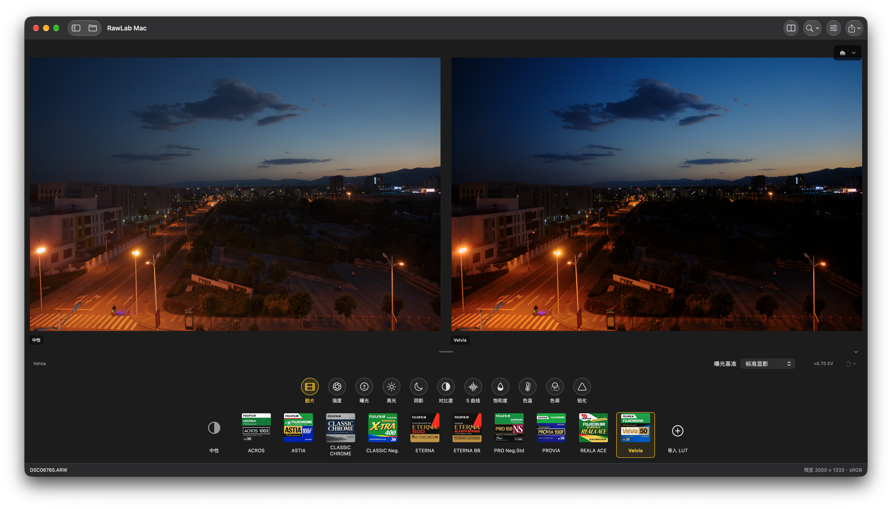

# RawLab

跨品牌 RAW 显影与富士胶片 LUT 工具，包含共享 C++ 处理核心、命令行工具和原生 Mac 客户端。

Cross-brand RAW development and Fujifilm film LUT tools, with a shared C++ processing core, command-line tools and a native Mac editor.

## 功能预览 / Preview

RawLab Mac 支持中性与胶片效果并排对比、胶片 LUT 切换、曝光与白平衡等参数调整，以及全分辨率导出。图中左侧为中性渲染，右侧为 Velvia 效果。

RawLab Mac provides side-by-side neutral/film comparison, LUT selection, exposure and white-balance adjustments, and full-resolution export. The screenshot shows the neutral render on the left and Velvia on the right.

## 下载 / Download

[下载 RawLab Mac v0.1 / Download v0.1](https://github.com/dancancer/RawLab/releases/tag/v0.1)

支持 Apple Silicon（arm64）和 macOS 26 或更高版本。应用采用 ad-hoc 签名，未经过 Apple 公证。

Requires Apple Silicon (arm64) and macOS 26 or later. The app is ad-hoc signed and has not been notarized by Apple.

## 文档 / Documentation

- [Mac 客户端：构建、使用与验证 / Mac editor: build, use and verification](RawLabMac/README.md)
- [处理核心与命令行工具 / Processing core and CLI](lutools/README.md)
- [RAW、色彩空间与 LUT 处理约定 / RAW, color-space and LUT contract](lutools/docs/color-contract.md)
